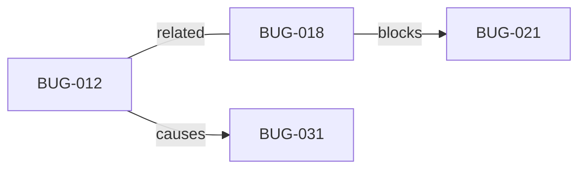

# Conversation: Bug Documentation and Traceability for LLM Agents

**Context:** Discussion between Sandeco and ChatGPT about a bug documentation
architecture oriented toward Codex, Claude Code, SDD, and Reversa agents.

------------------------------------------------------------------------

## Sandeco

What is the best way to document bugs so that LLMs in Codex and
Claude Code can document and/or later fix them? I want folder structure,
file names, etc.

------------------------------------------------------------------------

## ChatGPT

Sandeco, for **Codex + Claude Code**, I would create a bug system
**within the repository itself, oriented toward Markdown files and
explicitly designed for agents**.

My recommendation:

``` text
project/
│
├── AGENTS.md
├── CLAUDE.md
│
├── bugs/
│   ├── README.md
│   ├── index.md
│   │
│   ├── open/
│   │   ├── BUG-001-login-timeout.md
│   │   ├── BUG-002-video-black-screen.md
│   │   └── BUG-003-invalid-cache.md
│   │
│   ├── investigating/
│   │   └── BUG-004-memory-leak.md
│   │
│   ├── resolved/
│   │   └── BUG-005-token-refresh.md
│   │
│   └── templates/
│       └── bug-template.md
│
└── src/
```

## I would simply call it `/bugs`

I would not use:

``` text
docs/bugs/
issues/
problems/
errors/
```

For agents, **explicit semantics beats architectural elegance**.

``` text
bugs/
```

is impossible to misinterpret.

## The bug file

I would create **one bug per file**.

Example:

``` text
BUG-002-video-black-screen.md
```

Content:

``` markdown
---
id: BUG-002
title: Black screen when starting video
status: open
severity: high
priority: P1
created: 2026-07-13
updated: 2026-07-13
component: video-player
reproducible: always
---

# Black screen when starting video

## Summary

The player displays a black screen when the video is started for the first time.

## Expected Behavior

The first frame of the video should be rendered immediately after loading.

## Actual Behavior

The player remains black.

Audio plays normally.

## Steps to Reproduce

1. Start the application.
2. Open an existing project.
3. Select an MP4 video.
4. Press Play.

## Reproduction Rate

10/10

## Environment

- OS: Windows 11
- Browser: Chrome 140
- GPU: RTX 4070
- Application version: 0.8.2

## Evidence

- Console error: `VideoFrame is undefined`
- Screenshot: `evidence/BUG-002/black-screen.png`
- Log: `evidence/BUG-002/console.log`

## Suspected Area

Possibly related to:

- `src/video/player.ts`
- `src/video/renderer.ts`

Initial suspicion: renderer initialization occurs before the first frame is available.

## Acceptance Criteria

- The first frame must appear before playback.
- The video must not show a black screen.
- Audio and video must remain synchronized.
- Existing tests must continue passing.

## Verification

Run:

```bash
pytest
npm run test
npm run lint
```

Also perform the manual flow described in `Steps to Reproduce`.

## Resolution

Not resolved.

## Agent Notes

Do not alter the audio pipeline.

Avoid broad refactoring of the player during this bug fix.


    ## The most important part: YAML front matter

    This:

    ```yaml
    ---
    id: BUG-002
    title: Black screen when starting video
    status: open
    severity: high
    priority: P1
    created: 2026-07-13
    updated: 2026-07-13
    component: video-player
    reproducible: always
    ---

is **gold for LLMs**.

You can send:

> Fix all open P1 bugs.

The agent can search for:

``` yaml
status: open
priority: P1
```

Or:

> Analyze all bugs related to video-player.

It searches for:

``` yaml
component: video-player
```

This makes your system almost a **Markdown-based database**.

## Controlled status

I would use **only four states**:

``` text
open
investigating
blocked
resolved
```

None of:

``` text
doing
todo
done
working
fixing
analysis
in-progress
```

The smaller the ontology, the better for the agent.

Folders:

``` text
bugs/open/
bugs/investigating/
bugs/blocked/
bugs/resolved/
```

And the `status` must match the folder.

## Priority and severity are different things

I would keep both.

  Field        Meaning
  ------------ ----------------------
  `severity`   extent of the damage
  `priority`   urgency of the fix

### Severity

``` text
critical
high
medium
low
```

### Priority

``` text
P0
P1
P2
P3
```

## Evidence should be kept separate

``` text
bugs/
├── evidence/
│   ├── BUG-001/
│   │   ├── screenshot.png
│   │   ├── console.log
│   │   └── network.json
│   │
│   └── BUG-002/
│       ├── black-screen.png
│       └── reproduction.mp4
```

**Do not stuff giant logs inside the Markdown.**

## The `bugs/index.md`

I would maintain an **automatically generated** index.

``` markdown
# Bug Index

Last updated: 2026-07-13

## Summary

| Status | Count |
|---|---:|
| Open | 7 |
| Investigating | 2 |
| Blocked | 1 |
| Resolved | 14 |

## Open Bugs

| ID | Priority | Severity | Component | Title |
|---|---|---|---|---|
| BUG-001 | P0 | high | auth | Login timeout |
| BUG-002 | P1 | high | video-player | Black screen |
| BUG-003 | P2 | medium | cache | Invalid cache |
```

`index.md` is not the source of truth. The source of truth is each `BUG-XXX.md`.

## `bugs/README.md`

The README defines the canonical record, lifecycle, agent rules,
resolution protocol, and naming conventions.

## Codex and Claude Code

In `AGENTS.md`, define that the canonical record is in `/bugs`, require
reading `bugs/README.md`, defect reproduction, root cause identification,
regression testing, smallest coherent fix, and document update.

In `CLAUDE.md`, define the same protocol and prevent a bug from being
marked as resolved without root cause, test when technically possible,
verification, and acceptance criteria satisfied.

## Two workflows

``` text
/bug
/fix-bug
```

Conceptually:

``` text
/bug
    ↓
investigates the user's description
    ↓
searches for duplicates
    ↓
collects evidence
    ↓
creates BUG-XXX.md
    ↓
DOES NOT FIX
```

And:

``` text
/fix-bug BUG-002
    ↓
reads bug
    ↓
reproduces
    ↓
identifies root cause
    ↓
creates regression test
    ↓
fixes
    ↓
verifies
    ↓
documents resolution
    ↓
moves to resolved
```

**I would brutally separate `documenting a bug` from `fixing a bug`.**

------------------------------------------------------------------------

## Sandeco

And how to organize by feature, subsystem, or module, etc.? What is the best
approach?

------------------------------------------------------------------------

## ChatGPT

**I would not organize the physical folder by feature, module, or subsystem.**

My recommendation is:

> **status in the folder structure; technical domain in metadata.**

``` text
bugs/
├── open/
├── investigating/
├── blocked/
└── resolved/
```

In the bug:

``` yaml
---
id: BUG-042
title: Timeline loses sync after seek
status: open
priority: P1
severity: high

system: editor
subsystem: timeline
module: playback
feature: seek
component: video-sync

labels:
  - video
  - synchronization
  - regression
---
```

The initially proposed hierarchy was:

``` text
system
  └── subsystem
        └── module
              └── feature
                    └── component
```

But bugs frequently cross multiple modules. Additionally, the
diagnosis may change. Therefore, the architectural classification should
remain in metadata, and not determine the physical location of the
file.

## Separate `affected` from `root_cause`

Before investigation:

``` yaml
affected:
  systems:
    - editor
  subsystems:
    - timeline
  modules:
    - playback
```

After:

``` yaml
root_cause:
  system: rendering
  subsystem: frame-pipeline
  module: frame-buffer
  component: frame-cache
```

There is a fundamental difference between **where the bug appears** and **where the
bug originated**.

## Architecture catalog

A `bugs/taxonomy.yaml` was suggested to prevent agents from inventing
inconsistent names for systems, modules, and features.

Rule:

``` markdown
Architecture classification fields MUST use values defined in
`bugs/taxonomy.yaml`.

Do not invent new system, subsystem, module, feature, or component names.

If no existing classification is appropriate, use `unclassified` and document
the proposed taxonomy change in Agent Notes.
```

------------------------------------------------------------------------

## Sandeco

But we have to be careful not to end up with a very large
folder tree.

------------------------------------------------------------------------

## ChatGPT

Exactly. **I would reduce it considerably.**

For LLMs, deep trees tend to worsen navigation, increase ambiguity,
and require more searches. I would use at most **2 useful levels**.

``` text
bugs/
├── README.md
├── taxonomy.yaml
├── open/
├── active/
├── resolved/
└── evidence/
```

That is all.

The bugs:

``` text
bugs/open/BUG-042-timeline-desync.md
bugs/open/BUG-043-export-crash.md
bugs/active/BUG-018-memory-leak.md
```

The organization by feature, module, or subsystem stays **entirely in
the front matter**:

``` yaml
---
id: BUG-042
status: open

area: editor
module: timeline
feature: seek

priority: P1
severity: high
---
```

## Simplified ontology

  Field       Function
  ----------- -------------------------
  `area`      major product area
  `module`    main technical part
  `feature`   affected functionality

Example:

``` yaml
area: rendering
module: animated-typing
feature: cursor
```

For cross-cutting bugs:

``` yaml
areas:
  - editor
  - rendering

modules:
  - timeline
  - frame-buffer

feature: seek
```

The consolidated recommendation was:

``` text
bugs/
├── README.md
├── taxonomy.yaml
├── open/
├── active/
├── resolved/
└── evidence/
```

With classification:

``` yaml
area:
module:
feature:
```

**Status is navigation; architecture is metadata.**

------------------------------------------------------------------------

## Sandeco

Ah, and every bug must be traceable, linking the code or codes
(files) to the specs.

------------------------------------------------------------------------

## ChatGPT

**This changes the bug tracking architecture.** The bug should not just be a
defect report. It should function as a **traceability node
between SPEC <-> code <-> test <-> fix**.

``` text
SPEC
  ↓
CODE
  ↓
BUG
  ↓
FIX
  ↓
TEST
```

With bidirectional links whenever possible.

## Bug structure

``` yaml
---
id: BUG-042
title: Timeline loses sync after seek
status: open

area: editor
module: timeline
feature: seek

priority: P1
severity: high

specs:
  - specs/editor/timeline.md#seek
  - specs/rendering/frame-pipeline.md#frame-synchronization

code:
  - src/editor/timeline/seek.ts
  - src/rendering/frame-buffer.ts

tests:
  - tests/editor/timeline/seek.test.ts

introduced_by: unknown
fixed_by: null
---
```

The central idea:

``` text
BUG-042
│
├── specs[]
├── code[]
└── tests[]
```

**Always plural.**

## Explicit traceability section

``` markdown
## Traceability

### Specifications

- `specs/editor/timeline.md#seek`
- `specs/rendering/frame-pipeline.md#frame-synchronization`

### Affected Code

- `src/editor/timeline/seek.ts`
- `src/rendering/frame-buffer.ts`

### Tests

- `tests/editor/timeline/seek.test.ts`

### Trace

`timeline.md#seek`
→ `seek.ts`
→ `frame-buffer.ts`
→ `seek.test.ts`
```

It is not just a list of files. It is the **expected causal chain**.

## Affected code versus root cause

Before:

``` yaml
affected_code:
  - src/editor/timeline/seek.ts
  - src/rendering/frame-buffer.ts

root_cause_code: []
```

After:

``` yaml
affected_code:
  - src/editor/timeline/seek.ts

root_cause_code:
  - src/rendering/frame-buffer.ts
```

Recommended format:

``` yaml
traceability:
  specs:
    - specs/editor/timeline.md#seek

  affected_code:
    - src/editor/timeline/seek.ts

  root_cause_code:
    - src/rendering/frame-buffer.ts

  regression_tests:
    - tests/editor/timeline/seek.test.ts
```

## Hard rule in `bugs/README.md`

``` markdown
## Traceability Rule

Every bug MUST be traceable to the project specification and source code.

A bug record MUST identify:

1. The specification section defining the expected behavior.
2. The source code affected by the defect.
3. The root cause code, once identified.
4. The regression tests used to verify the fix.

A bug MUST NOT be marked as resolved if `traceability.specs`,
`traceability.root_cause_code`, or `traceability.regression_tests`
are empty.

If no specification exists for the affected behavior, the bug MUST be marked
as `spec-gap` and the missing specification must be created or updated before
resolution.
```

The key insight is `spec-gap`.

If the agent finds a bug and cannot link it to a SPEC:

``` yaml
labels:
  - spec-gap
```

The question arises:

> **Is it a bug, or was the behavior never specified?**

A bug can only be `resolved` when the traceability square is closed:

``` text
┌──────── SPEC ────────┐
│                      │
CODE                  BUG
│                      │
└──────── TEST ────────┘
```

**SPEC defines. Code implements. Bug exposes the divergence. Test
proves the divergence has been eliminated.**

------------------------------------------------------------------------

## Sandeco

I think a traceability matrix between bugs is important, a matrix
that would show the relationships between bugs. Does that make sense?

------------------------------------------------------------------------

## ChatGPT

It makes **a lot of sense**. It can be even more valuable for LLMs than
for humans.

The idea is to represent that bugs can be:

``` text
BUG-012 ── causes ──────► BUG-031
BUG-018 ── related to ──► BUG-024
BUG-021 ── blocks ───────► BUG-022
BUG-040 ── duplicates ───► BUG-017
BUG-052 ── regression of ► BUG-009
```

This prevents the agent from treating each bug as an island.

## Typed relationships

Not just:

``` yaml
related_bugs:
  - BUG-012
  - BUG-031
```

But:

``` yaml
relationships:
  - bug: BUG-012
    type: caused-by

  - bug: BUG-031
    type: blocks

  - bug: BUG-009
    type: regression-of
```

Small ontology:

  Relationship           Meaning
  ------------------ ---------------------------------------
  `related-to`       generic relationship
  `caused-by`        caused by another bug
  `causes`           causes another bug
  `blocks`           prevents the fix
  `blocked-by`       depends on another bug
  `duplicate-of`     duplicate
  `regression-of`    behavior returned
  `conflicts-with`   potentially conflicting fixes

## The matrix

File:

``` text
bugs/relationships.md
```

Example:

  Bug           BUG-012     BUG-018      BUG-021   BUG-031
  ------------- ----------- ------------ --------- ---------
  **BUG-012**   ---         related      ---       causes
  **BUG-018**   related     ---          blocks    ---
  **BUG-021**   ---         blocked-by   ---       ---
  **BUG-031**   caused-by   ---          ---       ---

The matrix **should not be the source of truth**.

The source of truth remains each `BUG-XXX.md`.

The matrix should be generated automatically:

``` text
BUG files
    ↓
parser
    ↓
relationships.md
```

## Two views

``` text
bugs/
├── matrix.md
└── graph.md
```

### `matrix.md`

Good for systematic comparison.

### `graph.md`

Mermaid:



The graph can allow an LLM to perceive clusters.

Example:

``` text
BUG-012
   │
   ├── causes BUG-031
   ├── causes BUG-044
   └── related BUG-018
```

Possible conclusion:

> "It does not make sense to fix BUG-031 and BUG-044 in isolation. BUG-012
> appears to be the structural defect."

## Bug Impact Score

Conceptual example:

``` text
impact =
  bugs_caused * 3
+ bugs_blocked * 2
+ regressions * 4
+ related_bugs
```

An agent could receive:

> Fix the open bug with the greatest systemic impact.

This is smarter than simply fixing the oldest P1.

## Consolidated structure

``` text
bugs/
├── README.md
├── taxonomy.yaml
├── matrix.md
├── graph.md
├── open/
├── active/
├── resolved/
└── evidence/
```

Each bug:

``` yaml
---
id: BUG-042
status: open

area: editor
module: timeline
feature: seek

relationships:
  - bug: BUG-018
    type: caused-by

  - bug: BUG-051
    type: blocks

  - bug: BUG-009
    type: regression-of

traceability:
  specs:
    - specs/editor/timeline.md#seek

  affected_code:
    - src/editor/timeline/seek.ts

  root_cause_code: []

  regression_tests: []
---
```

Traceability was organized into three dimensions:

``` text
1. VERTICAL
SPEC ↔ CODE ↔ TEST ↔ BUG

2. HORIZONTAL
BUG ↔ BUG

3. TEMPORAL
BUG → FIX → REGRESSION
```

This creates almost a **software defect knowledge graph**.

Bug documentation becomes a **causal failure memory for
software agents**.

------------------------------------------------------------------------

## Sandeco

These could be Reversa agents, right?

------------------------------------------------------------------------

## ChatGPT

**Exactly. And this fits better in Reversa than as an
isolated system.**

Reversa already does:

``` text
CODE → SPEC
```

The bug agents could expand to:

``` text
          ┌── BUG ──┐
          │         │
CODE ──► SPEC ◄──► TEST
  ▲       │         │
  └──── ROOT CAUSE ─┘
```

Specialized agents:

  Agent                  Function
  ---------------------- ---------------------------------------------
  **Bug Registrar**      transforms report/evidence into `BUG-XXX.md`
  **Bug Tracer**         links BUG <-> SPEC <-> CODE <-> TEST
  **Bug Correlator**     finds relationships BUG <-> BUG
  **Root Cause Agent**   investigates root cause
  **Spec Gap Agent**     detects behavior without SPEC
  **Bug Graph Agent**    generates matrix, graph, and clusters
  **Bug Prioritizer**    calculates systemic impact

The especially interesting part is the `Bug Correlator`.

It could read all bugs and discover:

``` text
BUG-012 → frame-buffer
BUG-031 → frame-buffer
BUG-044 → frame-buffer
BUG-052 → frame-buffer
```

And conclude:

> "Four apparently distinct bugs converge on the same component
> and the same chain of SPECs. There is evidence of a common structural
> cause."

This is **reverse engineering of failure**.

In Reversa, there could conceptually exist:

``` text
/reversa-bug
/reversa-bug-trace
/reversa-bug-correlate
/reversa-bug-graph
```

Or a single command:

``` text
/reversa-bug
```

with an **internal multi-agent loop**.

The central feature identified was:

> **Reversa not only reconstructs the software's intent from code.
> It can reconstruct the causal topology of failures.**

------------------------------------------------------------------------

# Consolidated conceptual synthesis

The proposal evolved from a simple `/bugs` directory to an architecture
of **agent-oriented causal defect memory**.

## Shallow structure

``` text
bugs/
├── README.md
├── taxonomy.yaml
├── matrix.md
├── graph.md
├── open/
├── active/
├── resolved/
└── evidence/
```

## Organization

-   **Status** determines the folder.
-   **Area, module, and feature** go in metadata.
-   Each bug is an independent Markdown file.
-   The YAML front matter enables deterministic search and processing.
-   The bug file is the source of truth.
-   Indexes, matrices, and graphs are generated views.

## Three dimensions of traceability

``` text
VERTICAL:   SPEC ↔ CODE ↔ TEST ↔ BUG
HORIZONTAL: BUG ↔ BUG
TEMPORAL:   BUG → FIX → REGRESSION
```

## Role of Reversa

``` text
CODE → SPEC
```

and, with the bug agents:

``` text
CODE ↔ SPEC ↔ BUG ↔ TEST ↔ ROOT CAUSE
```

The conceptual result is a **causal topology of software
failures**, maintained and explored by specialized Reversa agents.
